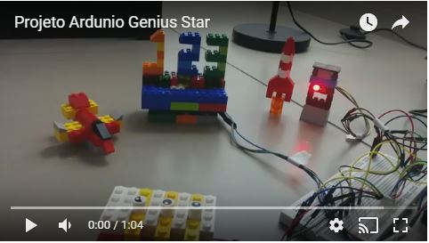
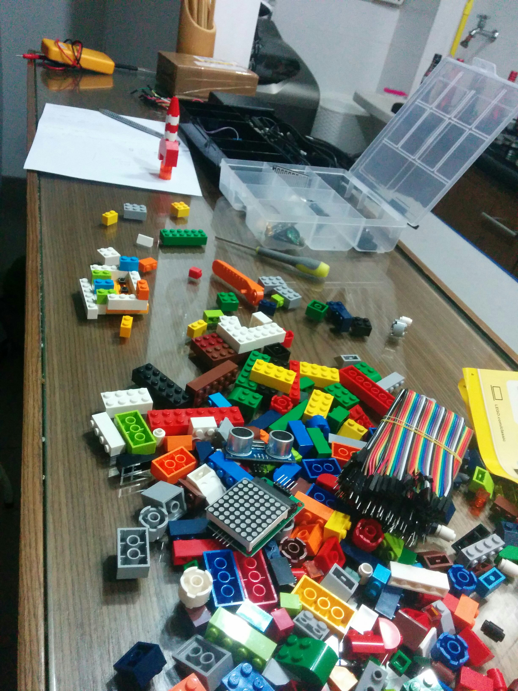
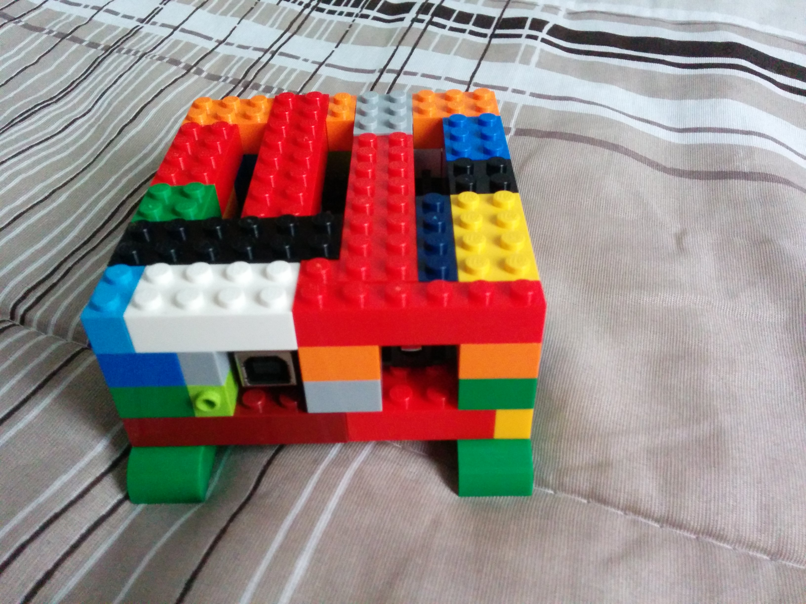
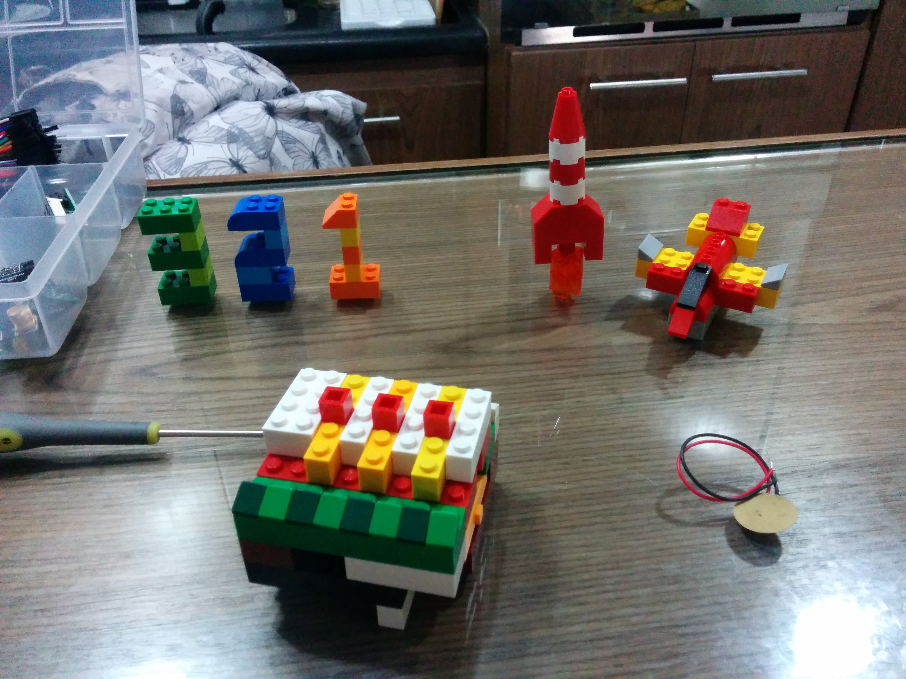
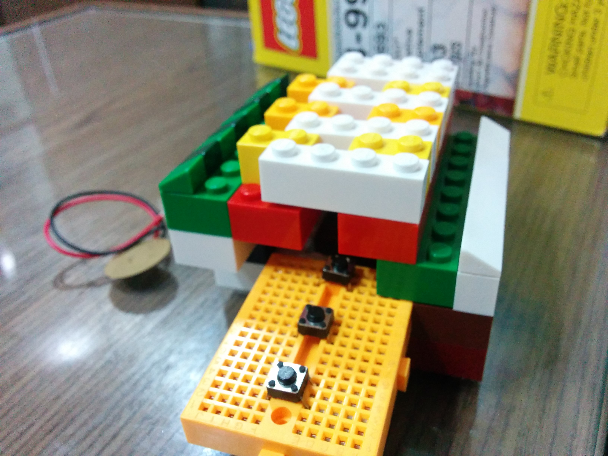
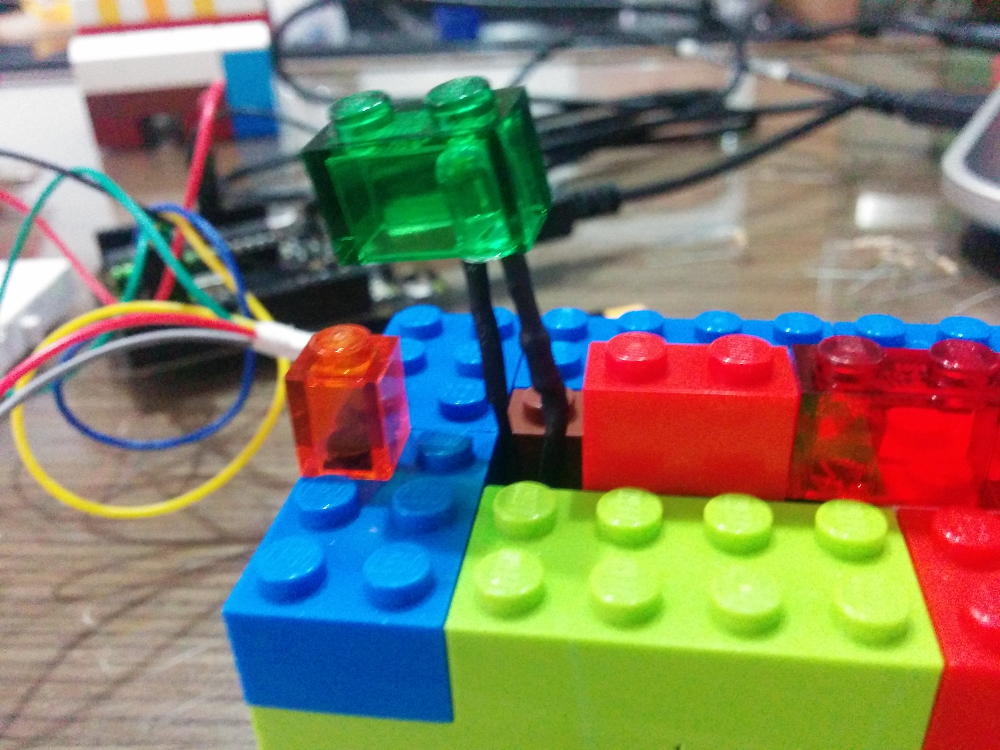
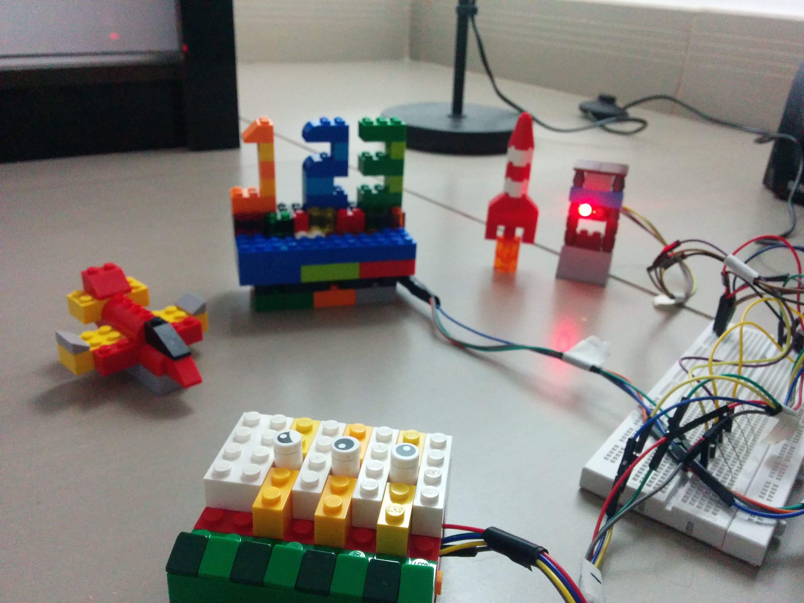

# ArduinoGeniusStar
Projeto baseado no jogo Genius para server à projeto de TCC do curso de Pedagogia de um colega. Um brinquedo lúdico e de simples confecção. Foram utilizados blocos de lego, Arduino Uno e pequenas peças eletrônicas. A parte eletrônica foi deixada exposta propositalmente.

O código "ArduinoCode.ino" está comentado em inglês.

## Material utilizado
- Arduino Uno
- Blocos de lego
- 3 Push buttons
- 1 mini protoboard
- 5 leds

## Fotos do projeto ([veja todas](images))

